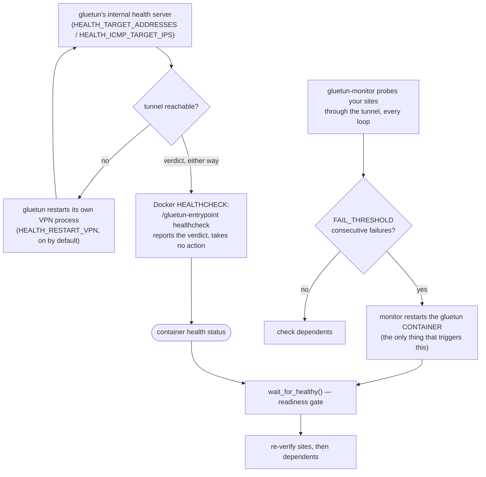

# Architecture

How the namespace sharing works, why a dependent gets stranded, how the
monitor finds its dependents, and the Docker API surface it needs.

## How Gluetun Network Mode Works

Containers can share Gluetun's network stack using Docker's container network mode:

```yaml
# Gluetun container
services:
  gluetun:
    image: qmcgaw/gluetun
    container_name: gluetun
    ports:
      - 8080:8080  # Expose ports for dependent apps here
    # ... VPN configuration

  # App using Gluetun's network
  myapp:
    image: myapp:latest
    network_mode: "container:gluetun"
    depends_on:
      - gluetun
    # Note: ports must be defined on gluetun, not here
```

When Gluetun restarts, containers using its network lose connectivity and typically need to be restarted. This monitor automates that process.

## Dependent-Aware Health (issue #20)

Dependents that use `network_mode: "service:gluetun"` (or `container:gluetun`)
share Gluetun's **network namespace**, and that share is bound to a specific
container **instance**. When Gluetun is restarted or recreated (e.g. a Watchtower
image update), those dependents are left **stranded loopback-only** — `Running`,
but with only the `lo` interface and no route to the internet. Because v1.x
tested connectivity *only from inside Gluetun*, every check passed and the
monitor reported healthy while the stack was broken.

v2 closes that blind spot by measuring each dependent directly, every loop:

1. **Interface check** — `ls /sys/class/net` inside the dependent. Only `lo` ⇒
   stranded (a hard failure; re-checked once because it won't self-heal).
2. **Viability probe** — for a live dependent, one **shuffled** resolvable name
   from your `sites.conf` is fetched *from inside that container*, proving its own
   DNS + connectivity. A different name each loop means
   `DEPENDENT_CONTAINER_FAILURES` consecutive failures = "this container can't
   reach N *different* names" (a container fault), not "one URL was down". If
   `sites.conf` has only IP literals, the monitor warns that dependent DNS can't
   be validated and falls back to a connectivity-only IP probe.
3. **Remediation** — keyed on the dependent's `NetworkMode` target vs Gluetun's
   current container id:
   - **same id** (incl. the monitor's own Gluetun restart) → `docker restart` the
     dependent — it rejoins the rebuilt namespace. Cheap, no new permissions.
   - **id changed** (Gluetun was replaced) → **recreate** the dependent.
     `NetworkMode` is immutable, so there is no in-place fix. The recreate is
     **non-destructive**: all mounts — named, bind, and **anonymous** volumes —
     are carried forward by source and the old container is removed *without*
     `-v`, so only the ephemeral writable layer is lost.
   - recreate **disabled** (`AUTO_RECREATE=0`) or denied → the dependent is
     reported **FAILED** loudly rather than papered over.

A dependent that fails counts up per-container and resets on any passing loop —
counters are in-memory with no backoff (recovery is cheap and non-destructive, so
the monitor simply re-acts each cycle). distroless/scratch dependents with no
shell can't be exec-probed and fall back to the inspect-based signals.

> **Note on discovery + recreate:** a dependent stranded by a Gluetun *recreate*
> still points at the dead old id, so auto-discovery (which matches Gluetun's
> *current* id/name) no longer recognizes it. A running monitor remembers
> dependents across cycles and handles this automatically. If you start the
> monitor *after* such a strand already exists, name the dependents explicitly
> via `DEPENDENT_CONTAINERS` so they're tracked from the first loop. At startup
> the monitor logs a **WARN** naming any running container stranded on a
> now-dead netns parent, so you know which ones to add — it won't auto-recreate
> them, since an orphan whose parent is gone can't be confirmed as *this*
> gluetun's dependent (first, do no harm).

## How Auto-Discovery Works

The monitor automatically discovers dependent containers by communicating with the Docker daemon — either through a [socket proxy](#docker-socket-proxy) (recommended) or a direct [Docker socket](https://docs.docker.com/engine/reference/commandline/dockerd/#daemon-socket-option) mount.

### Docker API Access

The monitor needs access to the Docker API to list, inspect, restart, and exec into containers. There are two ways to provide this:

**Socket proxy (recommended):** Set `DOCKER_HOST=tcp://socket-proxy:2375` and connect through an isolated network. The proxy limits API access to only the endpoints needed. See [Docker Socket Proxy](#docker-socket-proxy).

**Direct socket mount:** Mount `/var/run/docker.sock` into the container. Simpler but grants full Docker API access.

```yaml
# Socket proxy (recommended)
environment:
  - DOCKER_HOST=tcp://docker-socket-proxy:2375

# Or direct mount (simpler, less secure)
volumes:
  - /var/run/docker.sock:/var/run/docker.sock:ro
```

This is the same mechanism used by tools like [Portainer](https://www.portainer.io/), [Traefik](https://traefik.io/), and [Watchtower](https://containrrr.dev/watchtower/).

### Discovery Process

When discovery runs, the monitor:

1. **Queries Docker** for all running container IDs via `docker ps -q`
2. **Inspects each container** to get its `NetworkMode` setting via `docker inspect`
3. **Matches containers** where `NetworkMode` equals `container:<gluetun-name>` or `container:<gluetun-id>`
4. **Returns the list** of dependent container names

```bash
# What the monitor does internally:
docker inspect --format='{{.HostConfig.NetworkMode}}' <container_id>
# Returns: "container:gluetun" or "container:abc123def456..."
```

### When Discovery Runs

- **At startup** - For logging which containers will be managed
- **Every loop** - So newly added containers are picked up promptly, and so a
  dependent is re-checked each cycle. Discovered containers are also remembered
  across cycles, so a dependent isn't lost when Gluetun's container id changes
  (see [Dependent-Aware Health](#dependent-aware-health-issue-20)).

This approach means no configuration is needed - containers are discovered dynamically based on their actual Docker configuration.

For more details on the Docker Engine API, see the [official documentation](https://docs.docker.com/engine/api/).

## Gluetun's healthcheck — don't override it

Gluetun ships its own Docker `HEALTHCHECK` (`/gluetun-entrypoint healthcheck`, a 5-second interval). It is easy to assume that a watchdog wants something more thorough there and to replace it with a hand-rolled probe — a `wget --spider` against some public site is the common choice. **Leave it alone.** The override is strictly worse, and it does not do what people expect.



Two loops run independently, and they meet in exactly one place.

**Gluetun heals itself, and the Docker healthcheck has nothing to do with it.** Gluetun runs an internal health server and, with `HEALTH_RESTART_VPN` (on by default), restarts its own VPN process when its checks fail. That loop reads `HEALTH_TARGET_ADDRESSES` / `HEALTH_ICMP_TARGET_IPS` directly — **not** the Docker healthcheck. Overriding the Docker healthcheck therefore suppresses nothing and enables nothing; `/gluetun-entrypoint healthcheck` is only a *client* that surfaces that same internal verdict to Docker. Replacing it replaces the report, not the behaviour.

**The monitor never restarts gluetun because it is unhealthy.** The only thing that triggers a gluetun restart is `FAIL_THRESHOLD` consecutive failures of a **critical site probe**. Container health status is read in exactly one place: the readiness gate the monitor waits on *after* it has already restarted gluetun, bounded by [`HEALTHY_WAIT_TIMEOUT`](CONFIGURATION.md#healthy_wait_timeout). Unhealthy on its own causes no action at all.

That single consumer is what makes the override harmful:

- **It can fake-green the readiness gate.** An external probe reports on *that site's* reachability, which is not the same question gluetun is answering. It can read healthy while gluetun's own verdict is "broken, restarting the VPN" — so the monitor concludes its restart worked and moves on to the dependents on the strength of a signal gluetun disagrees with. This is the same failure class as [#137](https://github.com/csmarshall/gluetun-monitor/issues/137) and [#147](https://github.com/csmarshall/gluetun-monitor/issues/147): never count something as healthy on a measurement that didn't answer the question.
- **A long `interval` or `start_period` is dead time on every restart.** The gate polls every 5 seconds. A 30-second `interval` plus a 30-second `start_period` means the transition to healthy cannot be *observed* for 30–60 seconds, so the monitor sits in the gate that much longer each time it restarts gluetun. Gluetun's own check is 5s/10s.
- **It couples tunnel health to a third party.** If the site you picked has an outage, or geo-blocks the exit you rolled onto, gluetun reads unhealthy while the tunnel is fine.

If gluetun has **no** healthcheck at all, that is handled rather than fatal: the monitor sees health `unknown`, settles briefly and proceeds instead of burning the full timeout and raising a false "cannot recover" ([#84](https://github.com/csmarshall/gluetun-monitor/issues/84)). The DNS-stability check that follows is the real readiness gate. But gluetun's own healthcheck is strictly better than none, and better than anything you would write by hand.

> **One gluetun config note.** `HEALTH_TARGET_ADDRESS` (singular) is deprecated in favour of **`HEALTH_TARGET_ADDRESSES`** (plural) — gluetun logs a warning about it on every check. It is worth removing if you have it: the singular form takes one address, so a single unreachable target makes gluetun's *startup* check fail and restart the VPN in a tight loop. The plural default (`cloudflare.com:443,github.com:443`) does not have that failure mode.

## Docker Socket Proxy

The recommended deployment uses a [Docker socket proxy](https://github.com/Tecnativa/docker-socket-proxy) to restrict which Docker API endpoints gluetun-monitor can access. Instead of mounting the Docker socket directly (which grants full API access), the proxy exposes only the specific capabilities needed:

| Proxy Setting | Required For |
|---------------|-------------|
| `CONTAINERS=1` | Listing, inspecting, and reading logs of containers; creating the replacement when recreating a stranded dependent |
| `POST=1` | Restarting, removing, and starting containers (the recreate path rides on the same `POST` flag — no new permission) |
| `EXEC=1` | Running connectivity/interface probes inside Gluetun and the dependents |

All three are required. `POST=1` in particular is unavoidable: tecnativa's `POST` is a *binary* switch for the container API — with `POST=0`, the `EXEC` and `ALLOW_RESTARTS` carve-outs are inert, so neither probing nor restarting works (verified; see [#29](https://github.com/csmarshall/gluetun-monitor/issues/29)).

**If the monitor cannot probe, it does nothing.** Should `EXEC` be missing, the proxy become unreachable, or Gluetun stop shipping a usable `wget`, the site probes cannot *run* — which says nothing about the tunnel. Rather than mistake that for a connectivity failure and restart Gluetun (a restart cannot restore an EXEC permission), the monitor raises a distinct `attention` alert — *"cannot probe `<gluetun>`"* — holds its existing alerts, touches nothing, and never claims recovery it could not verify ([#137](https://github.com/csmarshall/gluetun-monitor/issues/137)).

**The same holds for a dependent it cannot see into** — and "cannot see into" includes a container that is *crash-looping*, because Docker reports one as `Running: true` throughout (`Running` means the daemon considers it alive, not that it works). Such a dependent is never counted as healthy and never remediated: restarting a container that is already restarting fixes nothing, and would bounce the network namespace its siblings share. It is reported instead — excluded from the healthy count but never hidden from the total (`dependents: 3/4 ok (1 unprobeable)`), and escalated to a *"cannot probe `<dependent>`"* `attention` alert if it stays unprobeable, which resolves itself the moment the container answers again ([#147](https://github.com/csmarshall/gluetun-monitor/issues/147)). A dependent *stranded* by a Gluetun recreate also crash-loops — its restart policy keeps starting it onto a dead namespace — so the strand check runs first and still heals it; only a container dying of its own accord is left alone.

On `wget` specifically: Gluetun installs GNU `wget` deliberately (it's an explicit `apk add` in its Dockerfile), but that is an *implementation detail* rather than a documented guarantee — whether its presence is part of Gluetun's supported surface is [an open question upstream](https://github.com/passteque/gluetun/discussions/3387). The monitor is built not to care: probes are classified on the **HTTP response**, not on `wget`'s exit code, so GNU and BusyBox `wget` behave identically — and if it ever disappears entirely, the paragraph above applies. We report; we do not restart.

The proxy and gluetun-monitor communicate over an isolated Docker network (`docker-proxy`). Only the proxy container has access to the Docker socket.
