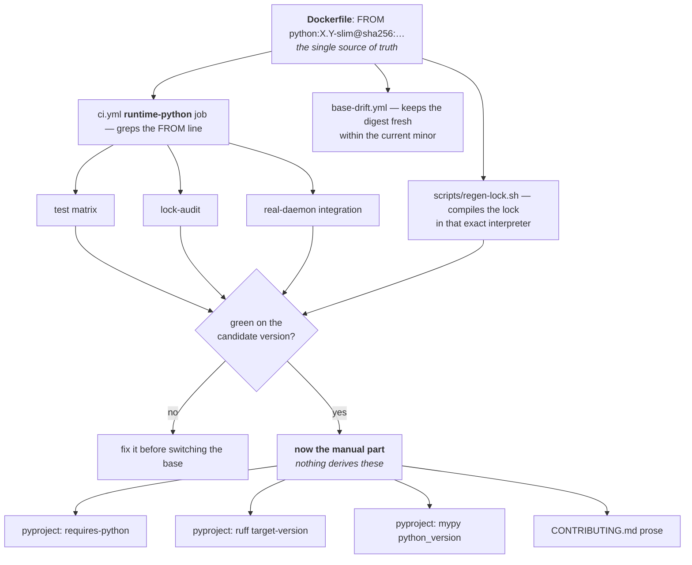

# Runbook: bumping the runtime Python

Every year or so CPython ships a new stable release and the `-slim` base this image is built on ages out. That is a chore, not a bug, and it should take ten minutes rather than an afternoon of archaeology. This is the checklist.

**The short version:** the runtime version lives in exactly one place — the Dockerfile's `FROM` line — and almost everything derives from it. Validate the candidate in CI *before* switching the base, then switch it, then regenerate the lock. Three settings in `pyproject.toml` and one line of prose in `CONTRIBUTING.md` are deliberately **not** derived and have to be edited by hand.

## What derives automatically, and what doesn't



The `runtime-python` job reads `FROM python:X.Y` out of the Dockerfile and publishes two outputs: `runtime` (the one version used by lint, types, tests, the lock audit, and the real-daemon integration job) and `versions` (the test matrix, normally just `[runtime]`). Nothing in CI can resolve or test against a version the image doesn't actually ship, which is the property worth preserving — see [#82](https://github.com/csmarshall/gluetun-monitor/issues/82) for what went wrong when the lock was compiled under a different interpreter than the image.

## The bump, X.Y → X.Z

**1. Validate the candidate before committing to it.** In `.github/workflows/ci.yml`, widen the `runtime-python` job's `versions` output to cover both:

```bash
echo "versions=[\"${runtime}\",\"3.Z\"]" >> "$GITHUB_OUTPUT"
```

Push and confirm the whole matrix is green on the new version. Do this first — discovering a dependency doesn't support X.Z *after* switching the base means debugging a broken build instead of a failing test.

**2. Switch the base.** Resolve the new digest:

```bash
docker buildx imagetools inspect python:3.Z-slim | grep -i '^Digest'
```

and update the Dockerfile's pinned `FROM python:X.Y-slim@sha256:…` to the new tag *and* digest. Keep it digest-pinned; the tag alone is mutable.

**3. Regenerate the lock under the new runtime.**

```bash
./scripts/regen-lock.sh      # reads the version from the Dockerfile automatically
```

Commit the result. The `lock-audit` job recompiles it in CI and fails if the committed lock doesn't match, so this is not optional. On a host where your user isn't in the `docker` group, run the container command inside that script with `sudo`.

**4. Narrow the matrix back** to just the new version — revert the step 1 edit.

**5. Do the manual edits below.**

## What is not auto-derived, by design

Three settings in `pyproject.toml`. These describe the **supported floor**, which is a policy choice rather than a consequence of the runtime, so nothing derives them — but a bump that forgets them leaves the tooling checking against a version you no longer ship:

| Setting | Where | What it controls |
|---|---|---|
| `requires-python` | `[project]` | the minimum interpreter the package claims to support |
| `target-version` | `[tool.ruff]` | which syntax and lints ruff assumes (`py314`-style, not `3.14`) |
| `python_version` | `[tool.mypy]` | which Python semantics mypy type-checks against |

Bump these only when you are deliberately dropping support for the old floor — that is a separate decision from moving the runtime, and it is fine for them to lag the base image.

Also: **`CONTRIBUTING.md` hardcodes the current version in prose** ("the runtime Python is whatever the Dockerfile declares — currently **3.14**"). It is explanatory rather than load-bearing, but it is the one place a reader will believe over the code, so update it in the same commit.

## Between bumps: nothing to do

`base-drift.yml` runs weekly, resolves the current digest of whatever `-slim` tag the Dockerfile declares, and bumps the pin if upstream re-published the base for security patches. That lands as a `fix:` commit, which opens a patch release PR, which ships a rebuilt image. It derives the tag from the Dockerfile too, so a version bump needs no edit there.

One implementation detail worth not "simplifying" away: base-drift checks out with `RELEASE_PLEASE_TOKEN` rather than the default token, because **a push made with `GITHUB_TOKEN` does not trigger further workflows** — the resulting commit would never reach release-please and the rebuild would silently never ship. The same rule bites elsewhere; see [#165](https://github.com/csmarshall/gluetun-monitor/issues/165).

## One thing to watch during a bump

Dependabot's `docker` ecosystem watches the base image, but `dependabot-auto-merge.yml` deliberately **excludes** it from auto-merge — a minor-version jump needs the matrix widened and validated first, which is exactly this runbook. So a `python:3.Z-slim` PR from Dependabot is a prompt to run these steps, not something to merge on green. Everything else in scope still fast-tracks normally.

## Cadence

Revisit when a new CPython stable lands (roughly each October), or sooner if the current `-slim` base stops receiving security rebuilds. There is nothing to do between times.
