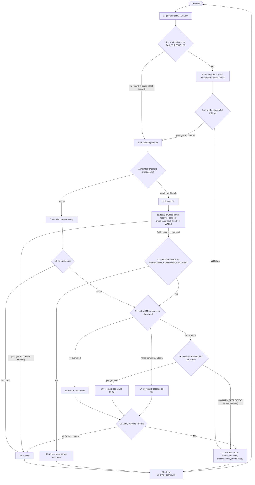

# ADR-0006: Per-dependent connectivity + DNS viability testing

- **Status:** Accepted
- **Date:** 2026-05-28
- **Extends:** ADR-0001 (testing from inside the namespace)
- **Feeds:** ADR-0004 (a dependent that fails is routed to detection/recovery)

## Context
ADR-0001 tests the URL set from inside gluetun — the authoritative "is the
tunnel up" signal. But (ADR-0004) a healthy gluetun does not prove the dependents
are healthy: a dependent can be stranded loopback-only (netns) or carry a
**per-container** fault — most notably a broken `/etc/resolv.conf`, which is
per-container filesystem and **not** shared by the netns. The #20 lesson is to
stop inferring stack health from the gateway and **measure each dependent
directly** (Tenet 6), without becoming trigger-happy (Tenet 3).

Two physical facts shape the design:
- All dependents **share gluetun's netns**, so a test from a dependent egresses
  the *same* `tun0`. The unique value of a per-dependent test is therefore (a)
  proving *that* container's binding is live and (b) exercising *that*
  container's own DNS — not a different network path. An **IP-only** test from a
  dependent is redundant with gluetun's; the per-container signal worth paying
  for is **DNS**, and a single **hostname** fetch proves DNS + connectivity at
  once — catching *DNS borked while IP is fine*.
- We are **not testing whether the names are up** — gluetun's root test already
  proved they resolve+connect through the tunnel. We reuse those known-good names
  purely to validate **each container's own** resolve+connect health.

## Decision
Each loop, in order:

1. **Interface check** (ADR-0004) classifies dependents as *live* vs **stranded
   loopback-only** (only `lo`). Stranded → a detected failure (recovery, the
   *hard* class below). The live set are the eligible viability-test workers.
2. **gluetun tests the full URL set** (existing ADR-0001 behavior) — the
   **root / authoritative** signal. If gluetun can't reach the set, the VPN
   itself is the problem → gluetun-restart recovery (ADR-0003), which
   **re-verifies the full set after the restart** and only proceeds to the
   dependent phase if the tunnel is restored; if still failing, dependents are
   left untouched until next cycle (don't churn them into a dead tunnel — Tenet 5).
3. **Per-dependent viability test — one shuffled name per loop.** Build the
   **resolvable-name pool** (the hostname URLs). For each live dependent, pick
   **one shuffled name** from the pool and test resolve+connect *from inside that
   container*. Each dependent shuffles **independently** (draws its own name), so
   the live set doesn't converge on one name in a given loop — which would amplify
   a single flaky name's blast radius across the stack. One hostname fetch proves
   that container's DNS + connectivity in a single quick-and-dirty test. If the
   pool is **empty** (all IP-literals), log a **`WARN`** that dependent DNS cannot
   be validated and fall back to one shuffled **IP** URL per container
   (connectivity only).
4. **Attribution — gluetun vouches; the shuffle isolates.** We do **not**
   cross-compare dependents. Because gluetun already proved the names good, a name
   failing from a dependent points at *that dependent*. To avoid condemning a
   container over one transient/down name, **each loop tests a different name**:
   a container is remediated only after it fails **`DEPENDENT_CONTAINER_FAILURES`
   consecutive loops = that many *distinct* names**. The shuffle is load-bearing —
   it is what makes "N consecutive failures" mean "this container can't reach N
   *different* names" (a container fault), not "one URL was down." A passing loop
   resets the container's counter. This holds even with a **single** resolvable
   name: a genuinely down name fails gluetun's root test too (→ its restart path,
   nodes 2–5), so a container-only failure is still correctly attributed to the
   container — the root test is the disambiguator, so a tiny pool is not a
   false-positive risk.
5. **Reaction — one knob, two failure classes (Tenet 8).**
   - **`DEPENDENT_CONTAINER_FAILURES`** (default `$FAIL_THRESHOLD`) — consecutive
     per-container failures before remediation. It mirrors gluetun's retry count
     so there is one mental model and one default for the whole stack; override
     only to tune dependents separately. (Capped at pool size: with fewer than N
     resolvable names, distinct names are exhausted and repeats are unavoidable.)
   - **In-memory and consecutive — no persistence, no backoff.** A container's
     counter resets on any passing loop (a failure two loops ago, with a pass
     since, is forgotten), and a monitor restart resets all counters to zero. We
     deliberately avoid persistent retry state or backoff/circuit-breaker logic:
     it is complex and fragile, and **recovery is cheap and non-destructive**
     (ADR-0005 — volumes preserved), so we accept the occasional extra restart
     over carrying elaborate state. A chronically-flapping container gets
     restarted repeatedly rather than specially suppressed — that surfaces the
     real problem (in logs / the FAILED state) instead of papering over it.
   - Two classes, different cadences (action per the ADR-0004 ID decision tree):

     | failure class | detection | confirmation | action |
     |---|---|---|---|
     | stranded loopback-only (hard; netns) | interface check (node 7) | single re-check (won't self-heal) | restart **or** recreate (ADR-0004) |
     | DNS/connect (soft; `eth0` present) | per-dependent name test (node 11) | `DEPENDENT_CONTAINER_FAILURES` consecutive *distinct* names | restart **or** recreate (ADR-0004) |
   - **Asymmetry, deliberate:** gluetun tests the **full set** each loop (root,
     comprehensive); each dependent tests **one shuffled name** per loop (spread
     load across many containers — see Load).
   - **FAILED state (Tenet 7):** when recovery can't restore health — gluetun
     won't come back after its restart, a dependent's post-recovery verify fails,
     or recreate is disabled/denied — the monitor enters an explicit **FAILED**
     state: report unhealthy loudly (and fire a notification once that layer
     exists — see ROADMAP) and retry next loop, rather than silently looping or
     reporting fake-green.

### Per-loop state machine
This diagram is the canonical flow; it spans ADR-0003 (gluetun restart),
ADR-0004 (the restart-vs-recreate decision tree) and ADR-0005 (the opt-in
recreate gate).



Nodes are **numbered for reference** (cite e.g. "node 14"); numbers are
phase-grouped — 1–5 gluetun, 6–10 classify, 11–13 viability, 14–19 remediate,
20–22 terminals — and may renumber if the flow is restructured. Convention:
**"node N"** refers to this diagram (1–22); **"step N"** refers to the numbered
Decision list above (1–5). Both **counter evaluations are explicit decisions** —
node 3 (`FAIL_THRESHOLD`, per gluetun site) and node 12
(`DEPENDENT_CONTAINER_FAILURES`, per dependent); the **retry/accumulation loop is
the outer loop** (node 22 → 1), each pass re-evaluating the counter — there is no
inner restart-retry (ROC: re-act each cycle). `(reset counters)` on the clean
paths is the per-loop reset.

**Load scales with live-dependent count — one lightweight exec per live dependent
per loop** (plus gluetun's full set). That's inherent: each container is verified
independently (you can't prove container X via container Y). It is O(#live deps)
per loop, **not** O(#deps × names), because each dependent runs a single name
test. A concurrency cap (`MAX_PARALLEL_CHECKS`, default ~6) + per-dispatch jitter
bound the burst on host CPU (one `docker exec` fork per job) and the shared tunnel.

**Degradation:** 0 live dependents → gluetun only (today's behavior). **No
resolvable names** (all IP-literals) → `WARN` + dependents tested against one
shuffled IP per loop (connectivity only; **dependent DNS is never validated** in
this config — a documented limitation). **distroless/scratch** dependents (no
shell to exec) can't be viability-tested → fall back to ADR-0004's
interface/inspect signals for those.

Per-dependent results log at DEBUG, e.g. (generic placeholders):

```
[DEBUG] Dependent app1: https://example.com ok (1064ms) [fails 0/2]
[DEBUG] Dependent app1: https://example.org FAILED (DNS) [fails 2/2 -> remediate]
```

## Consequences
- **Ground truth per dependent** (binding + connectivity + DNS), not inference —
  closes the #20 blind spot directly, per container.
- **One knob, one model:** `DEPENDENT_CONTAINER_FAILURES` reuses gluetun's
  retry-count semantics; nothing new to learn, and it defaults consistent.
- **The shuffle is load-bearing** and must be implemented as such: testing a
  *different* name each loop is what turns the consecutive-failure count into a
  container-health signal instead of a URL-uptime signal. Testing the same name
  repeatedly would be a bug.
- **Reaction stays conservative** (Tenet 8): the hard netns strand acts fast
  (single re-check); the soft DNS/connect fault waits `DEPENDENT_CONTAINER_FAILURES`
  loops so a transient blip never recreates a container.
- Requires `docker exec` into dependents (already required for gluetun, ADR-0001)
  and a runnable fetch tool in the image; **distroless/scratch** fall back to
  ADR-0004 interface/inspect signals.
- **Load is O(#live deps)/loop** — accepted as the cost of verifying each
  container independently; bounded by the concurrency cap + jitter.
- Worth **phasing**: (1) interface check + gluetun root test + safe restart;
  (2) per-dependent viability test + the `DEPENDENT_CONTAINER_FAILURES` gate.
- New knobs: `DEPENDENT_CONTAINER_FAILURES` (default `$FAIL_THRESHOLD`),
  `MAX_PARALLEL_CHECKS` (~6), jitter window, and an **opt-out** for the dependent
  viability layer — it is **on by default** (Tenet 8); the interface check is not
  optional.
