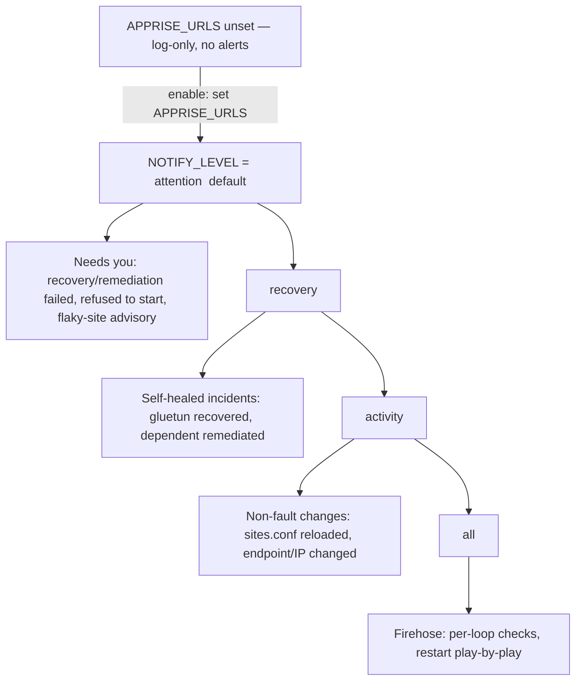
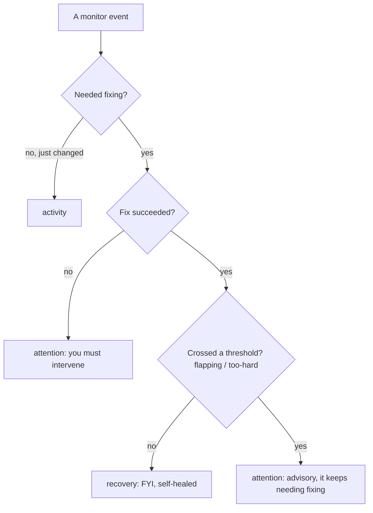
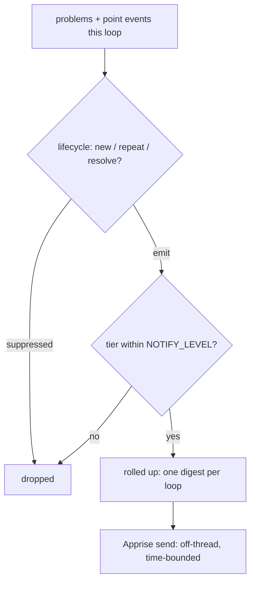

# ADR-0011: Notification tiers (actionability dial) + per-loop rollup digest

- **Status:** Accepted
- **Date:** 2026-06-05
- **Relates to:** ADR-0010 (the Apprise notification layer this configures),
  ADR-0012 (the edge-triggered alert lifecycle that feeds this dial),
  Tenet 7 (best-effort, non-blocking)

## Context
ADR-0010 added the notification channel; this decides **what** is sent and **how
it's grouped**. The first cut used a single severity floor (`NOTIFY_MIN_LEVEL`,
default WARN) — borrowed reflexively from log levels. That filters by *how bad a
line looks*, which is the wrong axis for an alert channel: a watchdog's whole job
is to self-heal, so the default signal an operator wants is *"I couldn't fix it —
your turn,"* not a play-by-play of every restart it handled on its own.

It also sent one notification per event. Because our "operations" are just
container restarts — sub-second to a few seconds — a single monitoring loop can
emit a **burst** of events almost simultaneously (gluetun recovered + three
dependents remediated + an advisory). Unlike systems whose failures trickle in over
minutes, ours cluster *within a loop*, so per-event sending is a notification storm.

## Prior art
- **Veritas Cluster Server** (the closest analog — HA failover notifications): four
  severities (`Information → Warning → Error → SevereError`) with a **cumulative
  floor** — you pick a level and get that and higher; default Warning. The level
  name encodes actionability (`SevereError` = data/service loss). ([VCS event
  notification, Linux](https://sort.veritas.com/public/documents/vie/7.0/linux/productguides/html/vcs_admin/ch13s01.htm),
  [Cluster Server 7.4.1 Admin Guide, Linux](https://www.veritas.com/content/support/en_US/doc/79561893-79561899-0/v30708461-79561899))
- **Google SRE** ("My Philosophy on Alerting"): route by actionability — **page /
  ticket / log**; a page must be urgent, real, and *actionable*.
- **Nagios** flap detection: track recent state changes, and on flapping **suppress
  the per-event storm in favor of one signal** — i.e. group, don't spam.

## Decision
**1. One dial — `NOTIFY_LEVEL` — keyed on actionability, cumulative, default
`attention`.** Four rungs (off = `APPRISE_URLS` unset):

| `NOTIFY_LEVEL` | Adds | Meaning | SRE | VCS |
|---|---|---|---|---|
| `attention` *(default)* | needs you | "do/decide something" — recovery failed, remediation failed, refused to start, **flaky-site advisory** | Page/Ticket | Error/SevereError |
| `recovery` | self-healed incidents | "broke — I fixed it" — gluetun restarted & recovered, dependent remediated & recovered | Ticket | Warning |
| `activity` | non-fault changes | "changed, no fault" — endpoint/IP changed, `sites.conf` reloaded | — | Information |
| `all` | firehose | per-loop checks / play-by-play | Log | Debug |

The flaky-site advisory lives in `attention` even though it summarizes recoveries:
it's the one self-healing-class event that asks a human to *decide* something
(review/remove a site), and as an edge-triggered rollup it gives the quiet floor the
*actionable summary* without the individual-restart stream.

**2. Rollup is the substrate, not a toggle.** Every notification is a single,
self-contained summary of a completed operation ("X failed → did Y → outcome");
the start/progress/end play-by-play exists only at `all`. The notifier's job is:
**collect a loop's events → filter by `NOTIFY_LEVEL` → emit one rollup.** Within a
loop, multiple surviving events are grouped into **one digest** notification
(colored by the worst tier present); a single event is sent as itself; the
one-shot CLI paths (`--notify-test`, refused-to-start) are a batch of one. There is
deliberately **no** separate "digest on/off" knob — grouping is how it works.

Severity (for the Apprise color/icon) is derived from the tier: `attention`→failure,
`recovery`→success, `activity`/`all`→info.

## How it works (diagrams)

**The dial — what each `NOTIFY_LEVEL` surfaces** (each level adds its own row to
everything above it):

**How an event earns its tier** — a self-heal is `recovery` (FYI) unless it crosses
a threshold, which promotes it to `attention`:

v1 wires the site-flapping threshold (`ADVISORY_WINDOW`/`ADVISORY_MIN_RESTARTS`/
`ADVISORY_DOMINANCE`). A dependent-flapping advisory and effort-based escalation
(retries/backoff — ties into #27) plug into the same "crossed a threshold?" gate
later, with no contract change.

**The pipeline** — why grouping is intrinsic (the rollup substrate):

The "lifecycle" step (edge-trigger, repeat, resolve, persistence) is ADR-0012.

## Consequences
- One conceptual knob (`NOTIFY_LEVEL`) plus operational tunables
  (`NOTIFY_REPEAT_INTERVAL` re-notify cadence in loops, `NOTIFY_TIMEOUT` send bound).
  No severity/scope/digest sprawl.
- Quiet-by-default-when-enabled: turning alerts on gets you only `attention` — exactly
  "tell me when interaction is required," with deeper levels opt-in.
- Per-loop grouping makes the channel usable for a fast-acting restarter where many
  systems would storm — a genuine fit for this tool's event cadence.
- `activity`/`all` are seeded but intentionally sparse in v1; new events slot into a
  tier later with no contract change.

## Alternatives considered
- **Severity floor (`NOTIFY_MIN_LEVEL`).** The shipped-but-unreleased first cut.
  Rejected: filters by appearance, not actionability; defaults to chatty.
- **Two dials (level + digest on/off).** Rejected as needless customization —
  rollup is strictly better here, so it's the default behavior, not a choice.
- **Per-event sends with downstream grouping (Alertmanager-style).** Rejected for
  v1: pushes the storm onto the user's backend; the loop is the natural batch
  boundary and we own it. A cross-loop digest could be a later refinement.
