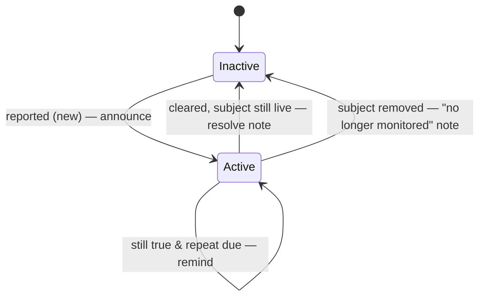

# ADR-0012: Edge-triggered alert lifecycle + persisted state

- **Status:** Accepted
- **Date:** 2026-06-05
- **Relates to:** ADR-0011 (the tier dial this feeds), ADR-0010 (the Apprise layer),
  ADR-0008 (the per-site stats sidecar this mirrors), Tenet 7

## Context
ADR-0011 decided *what* tier each event is and *how* a loop's events are grouped.
This decides *when* an ongoing problem is (re-)announced — the part that keeps the
channel from becoming noise.

A naive notifier sends on every loop a problem is true. But a watchdog re-checks
every `CHECK_INTERVAL`, so a fault that lasts an hour would fire ~120 times. The
operator's ask was explicit: **announce a problem once; don't send an unbounded
stream until I attend to it.** That is edge-triggering — alert on the *transition
into* a bad state, not its persistence — exactly what Nagios does when it detects
flapping and suppresses the per-event storm (ADR-0011, prior art).

Two consequences fall out:

1. To announce *once*, the notifier must **remember** which problems are already
   firing — and that memory must **survive a restart** of the monitor (updates,
   reboots — and it restarts containers, so restarts happen). Otherwise a restart
   re-announces everything still broken, or misses a resolve that happened while it
   was down.
2. If we announce a start, we should announce the **end** — but a problem can end
   two ways, and they are not the same message.

## Decision
A small state machine, `AlertState`, owns the lifecycle. Each loop the monitor
**reports** the problems currently true and **forgets** subjects it no longer
manages; at loop end the machine emits the transitions.

- **Edge-triggered:** a problem announces once, when it goes Inactive→Active.
- **Re-notify cadence — `NOTIFY_REPEAT_INTERVAL`, measured in loops** (the system is
  loop-driven, so loops are more meaningful than seconds). Default **0 = announce
  once, then silent until it resolves**; `N>0` reminds every `N` loops while it
  persists.
- **Two endings, two messages** (the load-bearing distinction):
  - **cleared** — the condition went away and the subject still exists → a **resolve**
    note at the *same tier as the alert* (so an `attention` alert's closure reaches
    the quiet floor — you hear it broke *and* that it's back).
  - **removed** — the subject is gone (site dropped from `sites.conf`, dependent
    excluded/removed) → a **"no longer monitored"** deprecation note. A "recovered"
    there would be a lie, but staying silent leaves the operator wondering where the
    alert went — so we say plainly that it was retired because the subject left.
- **Persisted** to a JSON sidecar (`NOTIFY_STATE_FILE`, mirroring ADR-0008's stats
  sidecar) — the active set *and* the loop counter. On startup it loads and
  reconciles on the first loop: still-broken problems are already Active so they
  don't re-announce; a problem that cleared while down resolves; best-effort, and a
  corrupt sidecar degrades to empty rather than crashing the watchdog.

The notifier (ADR-0011) stays a dumb sink — filter by tier, group, send. All
edge/repeat/resolve logic is here, which keeps both pieces simple and testable.

## Consequences
- A fault that lasts forever is **one** notification (+ optional reminders), then a
  resolve — bounded regardless of duration. This is the alert-fatigue fix.
- A second small sidecar under the logs mount. Best-effort; never gates the loop.
- "Attended to" is approximated by "resolved" (the condition cleared). A true
  **ack/silence** ("mute this, I'm on it") needs a control surface (CLI/file/HTTP)
  and is deliberately left as a follow-up.

## Alternatives considered
- **Level-triggered (notify every loop it's true) + a time throttle.** Rejected:
  the throttle only *thins* the stream; edge-triggering removes it. A throttle also
  can't tell "still broken" from "broke again."
- **In-memory only (no sidecar).** Rejected: a monitor restart would re-announce
  every active problem and lose pending resolves — common, since the monitor is
  itself a container that gets updated/restarted.
